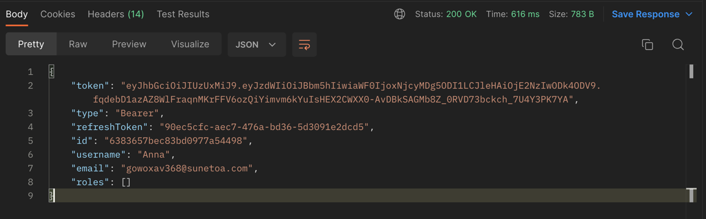
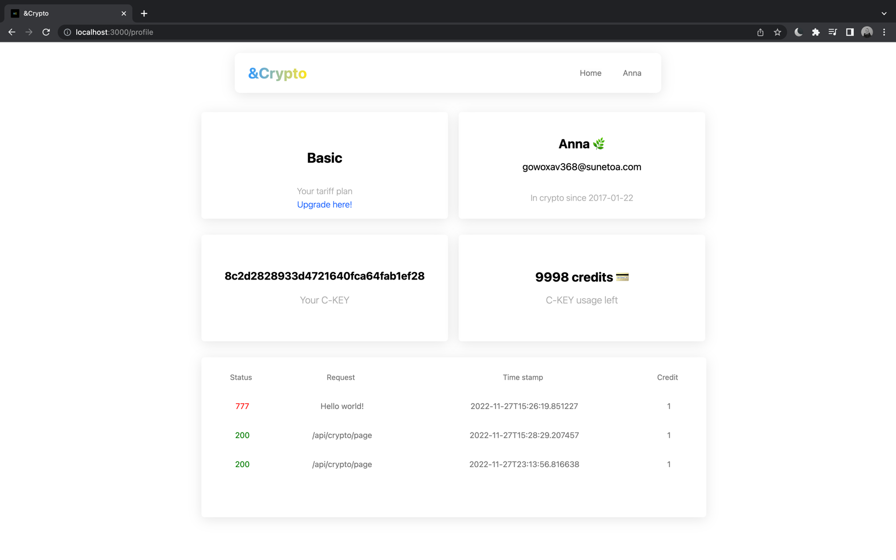
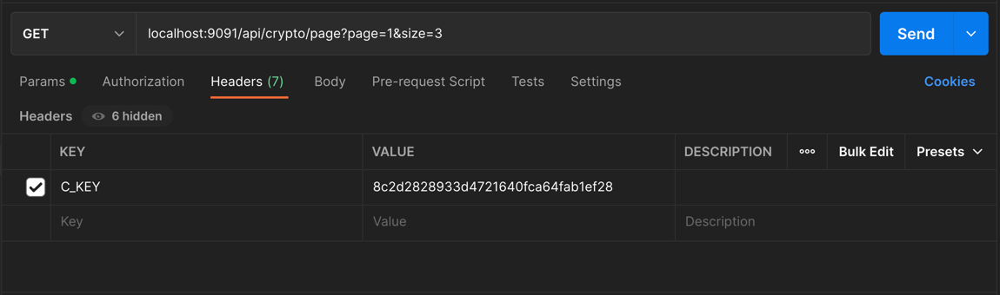

# &CRYPTO [Back-end][DEMO]

Developed a web application that can
to be used in the Internet of Things network for efficient processing and distribution of information about the cryptocurrency market and more detailed information about individual cryptocurrencies.

### Required to install

- Java 17
- Docker

### How to run

To get started you need to have Docker installed on your machine

Then, we need to run .yaml files, you can not only directly open them in IDE, but also in terminal
```bash
  docker-compose -f docker-mongoDB.yaml up
```


```
# "Put here your api key"
api.key = 4bcf051e1603553d4218e2cea8b00555
```

Finally, you need to connect smtp server and then you can use Gmail service for it.

### Notice ❗️

Notice! Since May 30, 2022, Google no longer supports the use of third-party apps, so you need to generate 'app
password' in your account instead of using your private password.

```
# Email
spring.mail.host=smtp.gmail.com
spring.mail.port=587
spring.mail.username=example_gmail@gmail.com
spring.mail.password=app_password_which_you_created
spring.mail.properties.mail.smtp.auth=true
spring.mail.properties.mail.smtp.starttls.enable=true
```

## Run it 

That's all, you need to run Application class in your IDE.

```java

@SpringBootApplication
@EnableMongoRepositories(repositoryBaseClass = ResourceRepositoryImpl.class)
public class CryptoApplication {
    //...
}
```

### Congratulations

Congratulations! You've done everything correct 🎉

### 🚀 Before

"I would recommend you to download PostMan, so then you can feel better how it works"

### 🌿 Start

Let's try to send some requests, but we need a C-KEY to do it;

You can get C-KEY after registration, then you'll get C-KEY on your email address. (To register you don't need anything)

`[POST] http://localhost:9091/api/auth/signin`

```
{
    "username": "Anna",
    "password": "123"
}
```
The response from the server is next


As I said, you will get the C-KEY on email, however if you are using the front-end part too, you can find your key is here

`http://localhost:3000/profile`



My C-KEY is `8c2d2828933d4721640fca64fab1ef28`. Let's try some requests with it.

---
`[GET]: /api/crypto/page?page=1&size=20`

Let's use our C-KEY to get response from the server.


```
{
    "totalPages": 165,
    "totalItems": 494,
    "currentPage": 1,
    "first": true,
    "last": false,
    "itemsPerPage": 3,
    "pageSize": 3,
    "items": [
        {
            "id": "bitcoin",
            "symbol": "btc",
            "name": "Bitcoin",
            "imageURL": "https://assets.coingecko.com/coins/images/1/large/bitcoin.png?1547033579",
            "currentPrice": 16845.55,
            "marketCap": 3.240841E11,
            "marketCapRank": 1.0,
            "totalVolume": 1.2509696E10,
            "high24": 16919.55,
            "low24": 16769.57,
            "priceChange": 72.61,
            "priceChangePercentage": 0.43291,
            "marketCapChange": 1.23566E9,
            "marketCapChangePercentage": 0.38274,
            "circulatingSupply": 1.9243924E7,
            "totalSupply": 2.1E7,
            "maxSupply": 2.1E7,
            "ath": 69045.0,
            "athChange": -75.60801,
            "athDate": "2021-11-10T14:24:11.849+00:00",
            "atl": 67.81,
            "atlChange": 24736.514,
            "atlDate": "2013-07-06T00:00:00.000+00:00",
            "lastUpdated": "2022-12-26T20:56:16.142+00:00"
        },
        ...
        {
            "id": "tether",
            "symbol": "usdt",
            "name": "Tether",
            "imageURL": "https://assets.coingecko.com/coins/images/325/large/Tether.png?1668148663",
            "currentPrice": 1.0,
            "marketCap": 6.6263618E10,
            "marketCapRank": 3.0,
            "totalVolume": 1.5375269E10,
            "high24": 1.002,
            "low24": 0.999481,
            "priceChange": -1.214126E-4,
            "priceChangePercentage": -0.01214,
            "marketCapChange": -2.0210612E7,
            "marketCapChangePercentage": -0.03049,
            "circulatingSupply": 6.6247647E10,
            "totalSupply": 6.6247647E10,
            "maxSupply": null,
            "ath": 1.32,
            "athChange": -24.41059,
            "athDate": "2018-07-24T00:00:00.000+00:00",
            "atl": 0.572521,
            "atlChange": 74.68703,
            "atlDate": "2015-03-02T00:00:00.000+00:00",
            "lastUpdated": "2022-12-26T20:55:08.082+00:00"
        }
    ]
}
```

---